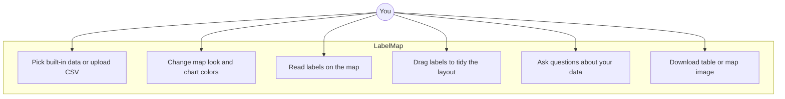
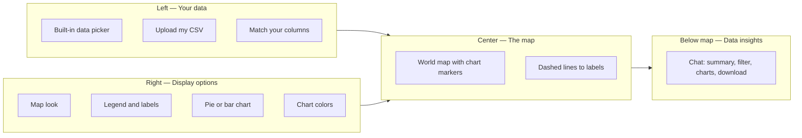
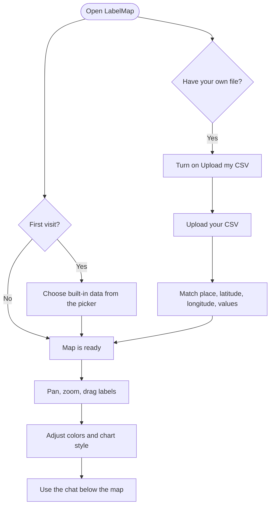
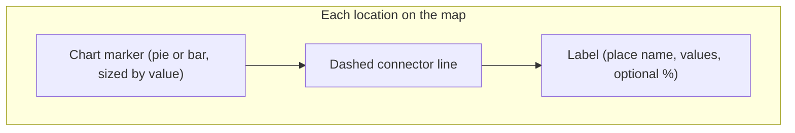
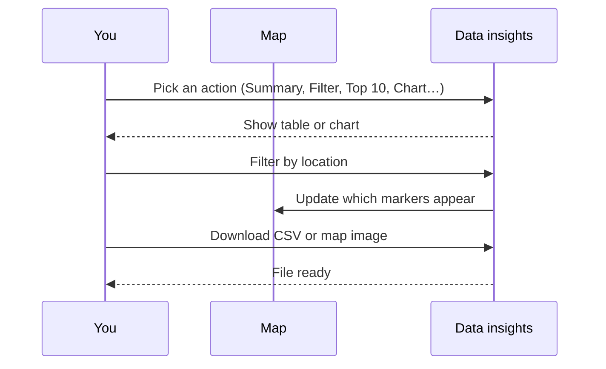

# LabelMap

Turn a spreadsheet of places into an interactive world map with chart markers and labels.

**Try it now:** https://label-map.streamlit.app

---

## What is LabelMap?

LabelMap reads a table of places and numbers, then draws them on a world map. Each location gets a small pie or bar chart at its position, with a text label connected by a dashed line.

It is built for anyone who has location data in a spreadsheet — analysts, journalists, students, or curious readers — and wants a clear map without learning GIS software, writing code, or designing layouts by hand.

Labels are placed automatically so they do not overlap. If a label sits in the wrong spot, drag it where you want. The map remembers your adjustments while you pan and zoom.

---

## What you can do

---

## How the screen is laid out

The app has three main columns, plus a chat panel below the map.

| Left | Center | Right |
|------|--------|-------|
| Choose your data | Interactive map | Map look, legend, labels, chart type, colors |
| | | |
| **Below the map (full width):** Data insights chat | | |

---

## Getting started

New to LabelMap? See the [User Guide](docs/USER_GUIDE.md).

**Step by step:**

1. Open the [live app](https://label-map.streamlit.app) in your browser.
2. On your first visit, a picker opens — search and choose built-in data under **Markets** or **Countries**, or close it to keep the default map.
3. To use your own file, turn on **Upload my csv** on the left, then upload your file.
4. If you uploaded a file, match your columns: place name, latitude, longitude, and the numbers you want on the chart.
5. Explore the map — pan, zoom, and drag labels to tidy the layout.
6. Use the right panel to change map style, chart type, colors, and which text appears on labels.
7. Scroll below the map to use the data insights chat for summaries, filters, charts, and downloads.

---

## Built-in data

| What | Plain description | Updates |
|------|-------------------|---------|
| **Markets** | Stock index performance for major economies (1 day, 7 days, or 30 days) | Live from Yahoo Finance |
| **Countries** | 27 World Bank indicators — population, GDP, life expectancy, CO₂ emissions, and more | Live from World Bank |
| **Your CSV** | Any file you upload | — |

If live data is temporarily unavailable, the app loads a saved backup copy automatically so the map still works.

---

## Your CSV file

Your file needs at least four kinds of information. Column names can be anything — you match them in the app.

| Column | What to put | Example |
|--------|-------------|---------|
| Place name | City, site, or country | `Bangkok` |
| Latitude | How far north or south (a number between −90 and 90) | `13.75` |
| Longitude | How far east or west (a number between −180 and 180) | `100.52` |
| Values | One or more numbers to show on the chart | `120`, `45` |

Not sure how to format your file? In the app, use **Download a sample** on the left to get a ready-made example.

---

## Understanding the map

Each place on the map has three parts:

- **Pie chart** — best when each place has one number (for example, population per country).
- **Bar chart** — best when each place has several numbers to compare side by side (for example, market index changes over different time periods).
- **Drag a label** — click and move it anywhere. Its position is remembered while you pan and zoom.

Bigger markers mean higher values when **Bigger markers for higher values** is turned on in the right panel.

---

## Data insights chat

Below the map, a chat panel helps you explore your data without leaving the page.

**Actions you can pick:**

| Action | What it does |
|--------|--------------|
| **Summary** | Overview table with key statistics for your data |
| **Filter** | Show only selected places — the map updates to match |
| **Top 10** | Ranked list of the highest values |
| **Bottom 10** | Ranked list of the lowest values |
| **Bar chart** | Visual comparison of one or two metrics |
| **Full table** | Every row in your current dataset |
| **Map image** | Save a picture of the map as you see it |
| **Download CSV** | Export your data (including any active filters) |

Filters apply only to the dataset you are viewing. Chat history carries across datasets, but filters reset when you switch data.

---

## Tips

- Built-in data opens in a searchable picker — browse **Markets** or **Countries**, or type to search.
- Turn labels on or off in **Labels on map** on the right (place name, values, percent change, combined total).
- Choose from six map styles under **Map look** — Voyager, Dark, Light, Street, Terrain, and Topo.
- Pick chart colors per value column in **Chart colors**.
- Use **Reset chat** in the insights panel to start a fresh conversation.

---

## For developers

To run locally, contribute, or read architecture diagrams and the per-module reference (all 23 Python files), see [CONTRIBUTING.md](CONTRIBUTING.md) and [docs/TECHNICAL.md](docs/TECHNICAL.md).

---

## License

MIT — see [LICENSE](LICENSE).

## Contact

**Pyae Phyo Kyaw** — [pyaek@icloud.com](mailto:pyaek@icloud.com) · [LinkedIn](https://www.linkedin.com/in/pyaek/)
