# LabelMap — Technical Documentation

This document describes the architecture, data models, core flows, and deployment of LabelMap for developers and maintainers.

**Live app:** https://label-map.streamlit.app

---

## Table of contents

1. [Introduction](#1-introduction)
2. [System context](#2-system-context)
3. [Architecture overview](#3-architecture-overview)
4. [Module reference](#4-module-reference)
5. [Data models](#5-data-models)
6. [Core flows](#6-core-flows)
7. [Custom Folium elements](#7-custom-folium-elements)
8. [Session state contract](#8-session-state-contract)
9. [External integrations](#9-external-integrations)
10. [Export pipeline](#10-export-pipeline)
11. [Deployment](#11-deployment)
12. [Maintainer scripts](#12-maintainer-scripts)
13. [Conventions](#13-conventions)
14. [Per-module reference](#14-per-module-reference)
    - [14.1 `labelmap/__init__.py`](#141-labelmap__init__py)
    - [14.2 `labelmap/config.py`](#142-labelmapconfigpy)
    - [14.3 `labelmap/paths.py`](#143-labelmappathspy)
    - [14.4 `labelmap/ui_copy.py`](#144-labelmapui_copypy)
    - [14.5 `labelmap/_debug_log.py`](#145-labelmap_debug_logpy)
    - [14.6 `labelmap/world_bank_baselines.py`](#146-labelmapworld_bank_baselinespy)
    - [14.7 `labelmap/data_io.py`](#147-labelmapdata_iopy)
    - [14.8 `labelmap/data_filter.py`](#148-labelmapdata_filterpy)
    - [14.9 `labelmap/data_insights.py`](#149-labelmapdata_insightspy)
    - [14.10 `labelmap/geo.py`](#1410-labelmapgeopy)
    - [14.11 `labelmap/charts.py`](#1411-labelmapchartspy)
    - [14.12 `labelmap/labels.py`](#1412-labelmaplabelspy)
    - [14.13 `labelmap/map_session.py`](#1413-labelmapmap_sessionpy)
    - [14.14 `labelmap/folium_elements.py`](#1414-labelmapfolium_elementspy)
    - [14.15 `labelmap/map_builder.py`](#1415-labelmapmap_builderpy)
    - [14.16 `labelmap/ui.py`](#1416-labelmapuipy)
    - [14.17 `labelmap/export.py`](#1417-labelmapexportpy)
    - [14.18 `labelmap/kpi_picker.py`](#1418-labelmapkpi_pickerpy)
    - [14.19 `labelmap/data_insight_ui.py`](#1419-labelmapdata_insight_uipy)
    - [14.20 `labelmap/data_insight_chat.py`](#1420-labelmapdata_insight_chatpy)
    - [14.21 `label_map.py`](#1421-label_mappy)
    - [14.22 `scripts/refresh_world_bank_baselines.py`](#1422-scriptsrefresh_world_bank_baselinespy)
    - [14.23 `tests/test_data_filter.py`](#1423-teststest_data_filterpy)

---

## 1. Introduction

LabelMap is a single-page Streamlit web application that converts location CSV files into interactive Folium maps. Each geographic point is rendered as a pie or column chart marker with auto-placed, draggable labels connected by dashed lines.

### Tech stack

| Layer | Technology |
|-------|------------|
| Language | Python 3.11+ |
| Web UI | Streamlit ≥1.33 |
| Maps | Folium ≥0.15, streamlit-folium ≥0.18 |
| Data | pandas ≥2.0, openpyxl ≥3.1 |
| Images | Pillow ≥10 |
| Optional export | Playwright ≥1.40 (Chromium screenshot) |
| Dev tooling | Ruff (lint), setuptools (packaging) |
| Map frontend | Custom Jinja2 Folium `MacroElement` JavaScript (Leaflet) |

### Entry point

```bash
streamlit run label_map.py
```

`label_map.py` must remain the Streamlit entry point — Streamlit Cloud expects this filename.

---

## 2. System context

### Use case diagram

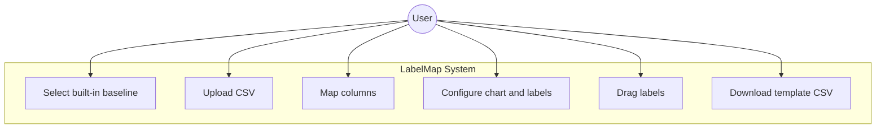

### External systems

| System | Role |
|--------|------|
| OpenStreetMap / Carto / Stadia / OpenTopoMap | Map tile layers |
| World Bank API (`api.worldbank.org/v2`) | Country metadata and indicator values |
| Yahoo Finance API (`query2.finance.yahoo.com`) | Live market index spark/chart data |
| Streamlit Cloud | Production hosting |
| Bundled CSV files | Offline fallbacks when APIs are unavailable |

---

## 3. Architecture overview

LabelMap follows a layered architecture: the Streamlit shell in `label_map.py` orchestrates data loading and UI controls, while the `labelmap/` package handles map construction, label placement, and session persistence.

### Component diagram

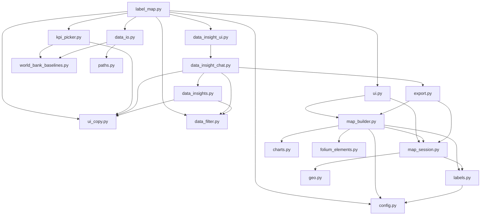

### Key design decisions

- **`@st.fragment` in `ui.py`** — The map rendering function `render_label_map_fragment()` is decorated with `@st.fragment` so label drags trigger a partial rerun of the map column only, not the full sidebar and control panels.
- **Tooltip round-trip** — Label drag positions are encoded in Folium marker tooltips and returned to Python via `st_folium`'s `last_object_clicked_tooltip`, avoiding custom Streamlit components.
- **Upload key invalidation** — When the data source changes, `active_upload_key` is updated and stale label positions are cleared.

---

## 4. Module reference

| Module | Responsibility |
|--------|----------------|
| `label_map.py` | Streamlit entry point; three-column layout; marker row construction; session state initialization; insight panel wiring |
| `labelmap/__init__.py` | Package metadata (`__version__`, `__app_name__`) |
| `labelmap/_debug_log.py` | Temporary JSON-line debug instrumentation |
| `labelmap/ui.py` | App intro, footer, privacy notice, template download; `@st.fragment` map rendering via `st_folium` |
| `labelmap/ui_copy.py` | Centralized user-facing strings (`UI_COPY`) and display-name formatters |
| `labelmap/kpi_picker.py` | Centered modal picker for built-in datasets (markets + World Bank) |
| `labelmap/data_insight_ui.py` | Stores map context in session state; delegates to insight chat |
| `labelmap/data_insight_chat.py` | Conversational insight panel: menus, filters, charts, map screenshot, CSV download |
| `labelmap/data_insights.py` | Pandas-only analytics: summary/ranked tables, Altair charts, narratives |
| `labelmap/data_filter.py` | Geographic/text filters shared by map and insight chat |
| `labelmap/data_io.py` | CSV I/O; World Bank and Yahoo Finance API clients; sample data loading; column mapping helpers |
| `labelmap/world_bank_baselines.py` | `WorldBankBaseline` dataclass registry (25 indicators); source attribution labels |
| `labelmap/map_builder.py` | Folium map assembly (`build_interactive_map`, `populate_map_layers`); chart and label layer injection |
| `labelmap/map_session.py` | Map view persistence; label drag sync; tooltip payload parsing; label position resolution |
| `labelmap/charts.py` | SVG pie/column chart icons; marker radius scaling; raster chart drawing for export |
| `labelmap/labels.py` | Label HTML generation; overlap-free placement algorithm; comparison percentage formatting |
| `labelmap/geo.py` | Bounds fitting, zoom calculation, Mercator pixel projection for export |
| `labelmap/folium_elements.py` | Custom Leaflet behaviors injected via Folium `MacroElement` (~1500 lines of JS) |
| `labelmap/config.py` | Map styles, zoom constants, label/legend theming, chart colors |
| `labelmap/export.py` | Playwright screenshot export with Pillow tile-stitching fallback; download href helpers |
| `labelmap/paths.py` | Asset path resolution (repo root, template file, Playwright browsers) |
| `scripts/refresh_world_bank_baselines.py` | Maintainer CLI to refresh bundled World Bank CSV fallbacks |
| `tests/test_data_filter.py` | Unit tests for `data_filter` and World Bank metadata enrichment |

See [Section 14](#14-per-module-reference) for step-by-step flows and per-file UML diagrams.

---

## 5. Data models

### CSV schemas

| Source | Required columns | Notes |
|--------|------------------|-------|
| User upload (CSV) | Location, Lat, Lon, D+ values | Column names configurable in UI via selectboxes |
| World Bank output | `Loc`, `Lat`, `Lon`, `{value_column}` | Produced by `build_world_bank_dataframe()` |
| World Index | `Loc`, `Lat`, `Lon`, `World Index 1d %`, `World Index 7d %`, `World Index 30d %` | Location format `"Country, MARKETCODE"`; enriched with live Yahoo data |

### WorldBankBaseline

Defined in `world_bank_baselines.py`:

```python
@dataclass(frozen=True)
class WorldBankBaseline:
    label: str              # Display name (e.g. "Population")
    value_column: str         # DataFrame column name (e.g. "Population")
    year: str                 # Snapshot year for attribution
    value_kind: ValueKind     # "int" or "float"
    csv_slug: str             # Filename under data/world_bank/
    indicator: str | None     # World Bank indicator code (e.g. "SP.POP.TOTL")
    derived_numerator: str | None    # For computed indicators
    derived_denominator: str | None
```

25 baselines are registered in `WORLD_BANK_BASELINE_BY_LABEL`, ordered for the Data source dropdown.

### MarkerRow (in-memory dict)

Built in `label_map.py` from each DataFrame row:

```python
{
    "idx": row_index,       # int — stable identifier for session state keys
    "lat": float,
    "lon": float,
    "values": [float, ...], # non-zero value columns only
    "labels": [str, ...],   # corresponding column names
    "colors": [hex, ...],   # per-value colors from UI color pickers
    "total": sum(values),
    "name": location_name,
}
```

### Class diagram

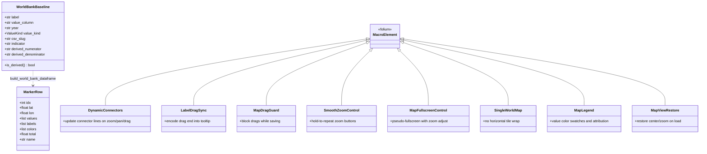

---

## 6. Core flows

### 6.1 Data loading

Three data paths converge on a pandas DataFrame before column mapping and marker row construction.

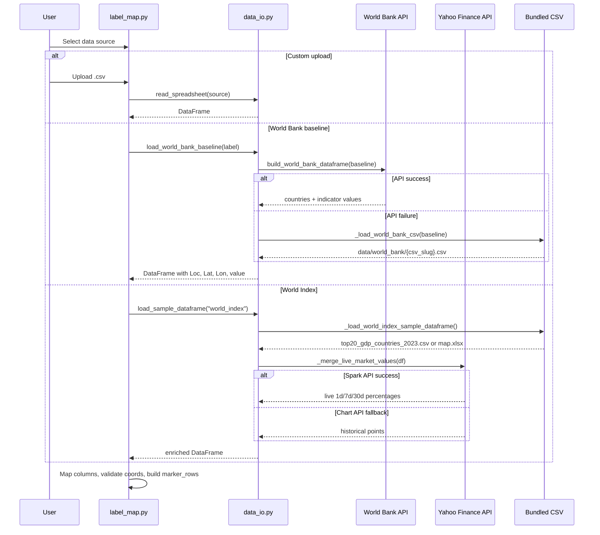

**World Bank fallback chain:** paginated JSON API → bundled CSV per indicator in `data/world_bank/`.

**Yahoo fallback chain:** Spark API (`_fetch_yahoo_spark_points`) → chart API (`_fetch_yahoo_points`) → static values in bundled CSV.

### 6.2 Map render and label drag sync

The map fragment reruns on label drag without rebuilding the full page.

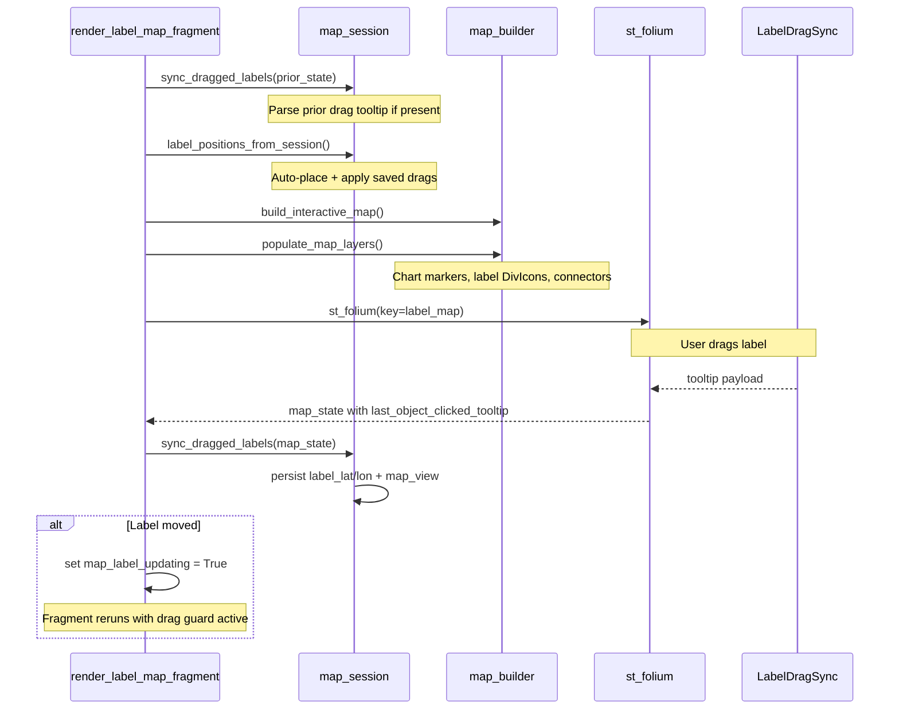

#### Tooltip payload protocol

Label drag positions are encoded by `LabelDragSync` JavaScript and parsed by `parse_label_drag_tooltip()` in `map_session.py`:

```
label:{idx}:{lat}:{lon}|{center_lat},{center_lon},{zoom},{fullscreen}
```

View-only sync uses a separate format parsed by `parse_map_sync_tooltip()`:

```
view:fs:{0|1}|{center_lat},{center_lon},{zoom}
```

### 6.3 Label placement

Auto-placement runs before user drags are applied.

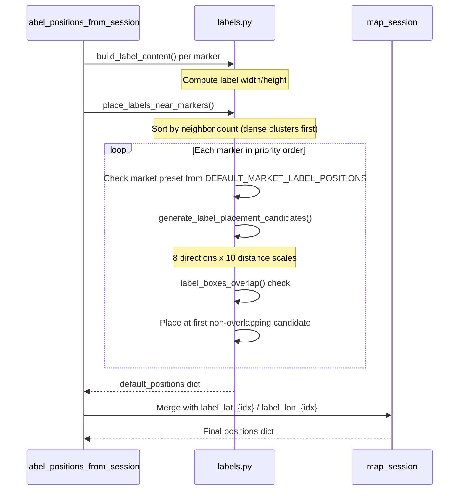

**Placement algorithm details:**

- 8 candidate directions: below, below-right, below-left, right, left, above, above-right, above-left
- Distance scales from 1.0× to 4.5× the base offset
- Dense clusters processed first (highest neighbor count)
- Market index labels use preset positions from `DEFAULT_MARKET_LABEL_POSITIONS` when overlap-free

---

## 7. Custom Folium elements

All interactive map behaviors are injected via Folium `MacroElement` subclasses in `folium_elements.py`. Each class renders a Jinja2 template with embedded Leaflet JavaScript.

| Class | Purpose |
|-------|---------|
| `DynamicConnectors` | Dashed polylines from chart marker to label; updates on zoom, pan, and drag |
| `LabelDragSync` | Encodes drag-end coordinates into marker tooltip for Streamlit round-trip |
| `MapDragGuard` | Semi-transparent overlay blocking interaction while label position saves |
| `MapSaveComplete` | Signals save completion to remove drag guard |
| `MapFrameFill` | Ensures map container fills available height |
| `SmoothZoomControl` | Custom zoom buttons with hold-to-repeat |
| `SingleWorldMap` | Disables horizontal tile wrapping; bounds panning |
| `MapViewRestore` | Restores center/zoom/fullscreen on map load |
| `MapFullscreenControl` | Pseudo-fullscreen toggle with zoom adjustment |
| `FullscreenStateSync` | Syncs fullscreen state back to Streamlit |
| `MapLegend` | Value color swatches with World Bank/Yahoo attribution |
| `ExportMapStyles` | Styles for Playwright screenshot capture |
| `ExportReady` | Signals export readiness via `data-map-export-ready` attribute |

---

## 8. Session state contract

Streamlit session state keys used by LabelMap:

| Key | Type | Purpose |
|-----|------|---------|
| `active_upload_key` | str | Hash identifying current data source; invalidates stale label positions on change |
| `map_view` | dict | `{center_lat, center_lon, zoom, fullscreen}` — persisted map viewport |
| `map_view_upload_key` | str | Upload key associated with current `map_view` |
| `label_lat_{idx}` | float | User-dragged label latitude for marker `idx` |
| `label_lon_{idx}` | float | User-dragged label longitude for marker `idx` |
| `marker_type` | str | `"pie"` or `"column"` |
| `show_lbl_name` | bool | Show location name in labels |
| `show_lbl_values` | bool | Show individual values in on-map labels (default `false`; values always appear in marker hover tooltips) |
| `show_lbl_total` | bool | Show total in labels |
| `scale_by_total` | bool | Scale marker size by total value |
| `show_legend` | bool | Show map legend |
| `map_style` | str | Selected tile layer style |
| `chart_color_{col}` | str | Hex color for value column `col` |
| `map_label_updating` | bool | True while saving label drag; blocks further drags |
| `label_map` | dict | Prior `st_folium` return state (used for drag sync) |
| `map_world_fit_pending` | bool | Flag to fit map to data bounds on next render |
| `_last_value_col_count` | int | Tracks value column count for color picker defaults |
| `data_insight_filter_regions` | list[str] | Selected World Bank regions for insight/map filter |
| `data_insight_filter_countries` | list[str] | Selected countries for insight/map filter |
| `data_insight_filter_locations` | list[str] | Applied location keys for insight/map filter |
| `data_insight_filter_pending_locations` | list[str] | Pending location selection before Apply |
| `data_insight_filter_location_options` | list[tuple] | Cached location chip options for filter UI |
| `data_insight_search` | str | Free-text search applied to location/country names |
| `data_insight_metric` | str | Selected value column for ranked insight actions |
| `data_insight_pending_action` | str | Queued insight action awaiting metric selection |
| `data_insight_pending_chart_metrics` | list[str] | Pending metrics for comparison chart |
| `data_insight_map_context` | dict | Map render parameters for insight screenshot export |
| `data_insight_chats` | dict | Per-upload-key chat message persistence |
| `_data_insight_full_count` | int | Total row count before filtering (for status text) |

### Lifecycle

1. **New upload** — `active_upload_key` changes; keys matching `label_lat_*` and `label_lon_*` are deleted; display defaults reset per data source type.
2. **Label drag** — `label_lat_{idx}` and `label_lon_{idx}` updated; `map_view` updated with current center/zoom; `map_label_updating` set until save completes.
3. **Data source switch** — World Bank baselines default to pie markers with labels off; World Index defaults to column markers with place name and percent change on (values off on-map, available on hover).

### Right panel tabs

The third column uses `st.tabs` with three panels:

| Tab | Controls |
|-----|----------|
| **Map** | Map style picker (primary styles + “More styles” expander), show legend |
| **Labels** | Place name, percent change / combined total, scale marker size |
| **Colors** | Chart type (hidden when only one value column), color pickers inside a collapsed “Customize colors” expander |

Session keys are unchanged; widgets write to the same `map_style`, `show_lbl_*`, `marker_type`, and `chart_color_*` keys as before.

---

## 9. External integrations

### World Bank API

- **Countries:** `GET /v2/country?format=json` (paginated, 400 per page)
- **Indicators:** `GET /v2/country/all/indicator/{code}?date={year}&format=json`
- **Derived indicators:** Two API calls (numerator ÷ denominator) for computed baselines
- **Fallback:** `data/world_bank/{csv_slug}.csv` bundled in repo
- **Coordinate fallbacks:** Hard-coded lat/lon for territories missing from API metadata

### Yahoo Finance API

- **Spark API:** Batch fetch for multiple symbols (`_fetch_yahoo_spark_points`)
- **Chart API:** Individual symbol historical points (`_fetch_yahoo_points`)
- **Symbols mapped:** SPX500→^GSPC, UK100→^FTSE, GRA40→^FCHI, JPN225→^N225, HKG50→^HSI, AUS200→^AXJO, Canada60→^GSPTSE
- **Fallback:** Static percentage values in bundled CSV

### Map tile providers

Configured in `config.py` as `MAP_STYLE_OPTIONS` and `MAP_TILE_URL_TEMPLATES`:

- OpenStreetMap (default light)
- Carto Dark Matter
- Stadia Alidade Smooth Dark
- OpenTopoMap

---

## 10. Export pipeline

Map image export is implemented in `export.py`. The insight chat panel calls `insight_map_screenshot()` when the user selects **Map image**; standalone `export_map_image()` is available for programmatic use. Two strategies are available:

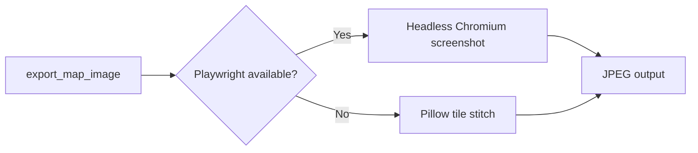

**Playwright path:**
1. Render Folium map to temporary HTML
2. Launch headless Chromium at 2400×1400 viewport
3. Wait for `[data-map-export-ready="true"]` selector
4. Screenshot `.leaflet-container` element

**Pillow fallback:**
1. Fetch map tiles for computed zoom level
2. Project markers, labels, and connectors onto raster canvas
3. Save as JPEG

Install optional export dependencies:

```bash
pip install -e ".[export]"
playwright install chromium
```

---

## 11. Deployment

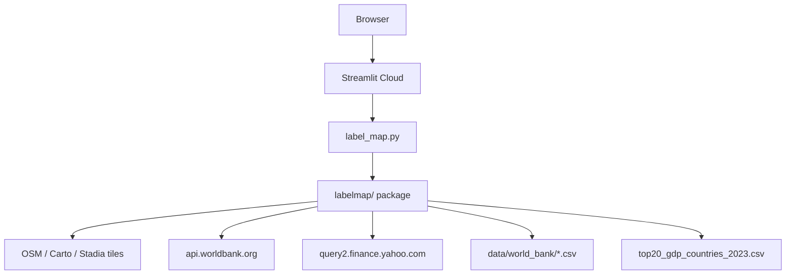

### Network requirements

| Feature | Requires network |
|---------|-----------------|
| Map tiles | Yes |
| World Bank live data | Yes (CSV fallback available) |
| Yahoo Finance live data | Yes (static CSV fallback available) |
| Custom upload | No (local file only) |
| Playwright export | No (local browser) |

### Streamlit Cloud configuration

- Entry point: `label_map.py`
- Python version: 3.11+
- Dependencies: `requirements.txt`
- Config: `.streamlit/config.toml` (dark theme, 200MB upload limit)

---

## 12. Maintainer scripts

### Refresh World Bank baselines

```bash
python scripts/refresh_world_bank_baselines.py
```

Fetches fresh data from the World Bank API and writes CSV fallbacks to `data/world_bank/`. Clears LRU caches between requests to avoid stale data.

---

## 13. Conventions

| Convention | Detail |
|------------|--------|
| Entry point | `label_map.py` (required by Streamlit Cloud) |
| Package name | `labelmap` (no hyphen) |
| Repo folder | `label-map` (with hyphen) |
| Line length | 100 characters (Ruff) |
| Long strings | `ui.py` exempt from E501 |
| Version | 1.0.0 (`labelmap/__init__.py`, `pyproject.toml`) |
| CI | Ruff lint + import verification on Python 3.11; unit tests in `tests/test_data_filter.py` |

---

## 14. Per-module reference

This section documents each project Python file with a standardized structure: purpose, dependencies, public API, step-by-step execution flow, and UML diagrams. Cross-cutting flows (data loading, label drag, placement) are summarized in [Section 6](#6-core-flows); per-module sections reference those where appropriate.

### Layered dependency overview

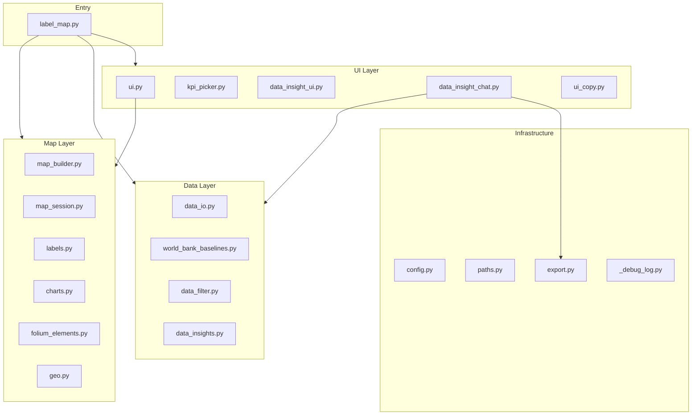

### Per-module template

Each subsection below follows: **Purpose** → **Dependencies** → **Public API** → **Step-by-step flow** → **UML** → **Notes** (when needed).

---

### 14.1 `labelmap/__init__.py`

**Purpose** — Declares package identity. Exports `__version__` (`"1.0.0"`) and `__app_name__` (`"LabelMap"`). Does not import other modules.

**Dependencies** — None.

**Public API**

| Symbol | Type | Summary |
|--------|------|---------|
| `__version__` | str | Semantic version string |
| `__app_name__` | str | Human-readable application name |

**Step-by-step flow**

1. Python imports the `labelmap` package.
2. Module-level constants are assigned.
3. Callers read `labelmap.__version__` for display or packaging checks.

**Notes** — Version is mirrored in `pyproject.toml`.

---

### 14.2 `labelmap/config.py`

**Purpose** — Centralizes visual constants, map tile configuration, zoom behavior, and theme helpers for labels, connectors, and legends. Does not perform I/O or render UI.

**Dependencies** — `math` (stdlib).

**Public API**

| Symbol | Type | Summary |
|--------|------|---------|
| `DEFAULT_CHART_COLORS` | list[str] | Default hex palette for chart segments |
| `MAP_STYLE_OPTIONS` | dict | Display name → Folium tile layer name |
| `MAP_TILE_URL_TEMPLATES` | dict | Tile layer name → URL template |
| `world_fit_zoom()` | function | Compute zoom level to fit world width |
| `default_interactive_zoom()` | function | Return minimum interactive zoom |
| `map_style_is_dark()` | function | True when style uses dark theme |
| `connector_style_for_map_style()` | function | Connector color/opacity for map style |
| `label_theme_for_map_style()` | function | Text/panel colors for label HTML |
| `build_label_style()` | function | Inline CSS for draggable labels |
| `build_legend_style()` | function | Inline CSS for map legend panel |

**Step-by-step flow**

1. Module loads constants (`APP_FONT_STACK`, marker radii, export dimensions, zoom step sizes).
2. When a map style is selected, `map_style_is_dark()` determines light vs dark branch.
3. `label_theme_for_map_style()` returns a theme dict (`text_color`, `panel_bg`, etc.).
4. `build_label_style()` / `build_legend_style()` produce inline CSS strings consumed by `labels.py` and `folium_elements.py`.

**UML — theme dict structure**

```mermaid
classDiagram
    class LabelTheme {
        +str text_color
        +str muted_color
        +str panel_bg
        +str panel_shadow
        +str swatch_border
    }
    class ConnectorStyle {
        +str color
        +float opacity
    }
    config_py["config.py"] --> LabelTheme : label_theme_for_map_style
    config_py --> ConnectorStyle : connector_style_for_map_style
```

---

### 14.3 `labelmap/paths.py`

**Purpose** — Resolves filesystem paths for bundled assets and Playwright browsers across development, PyInstaller, and `LABELMAP_APP_DIR` override environments.

**Dependencies** — `os`, `sys`, `pathlib` (stdlib).

**Public API**

| Symbol | Type | Summary |
|--------|------|---------|
| `app_dir()` | function | Application root directory |
| `repo_root()` | function | Repository root (parent of `labelmap/`) |
| `sample_template_file_path()` | function | Path to `labelmap-sample.csv` or `None` |
| `template_file_path()` | function | Path to `map.xlsx` or `None` |
| `playwright_browsers_path()` | function | `.playwright-browsers` under repo root |

**Step-by-step flow**

1. `app_dir()` checks `LABELMAP_APP_DIR` env var, then PyInstaller `_MEIPASS`, else package directory.
2. `repo_root()` returns `Path(__file__).parent.parent`.
3. Template helpers iterate a deduplicated search list (`data/`, repo root, cwd) and return the first existing file.
4. `playwright_browsers_path()` joins repo root with `.playwright-browsers`.

**UML — path resolution**

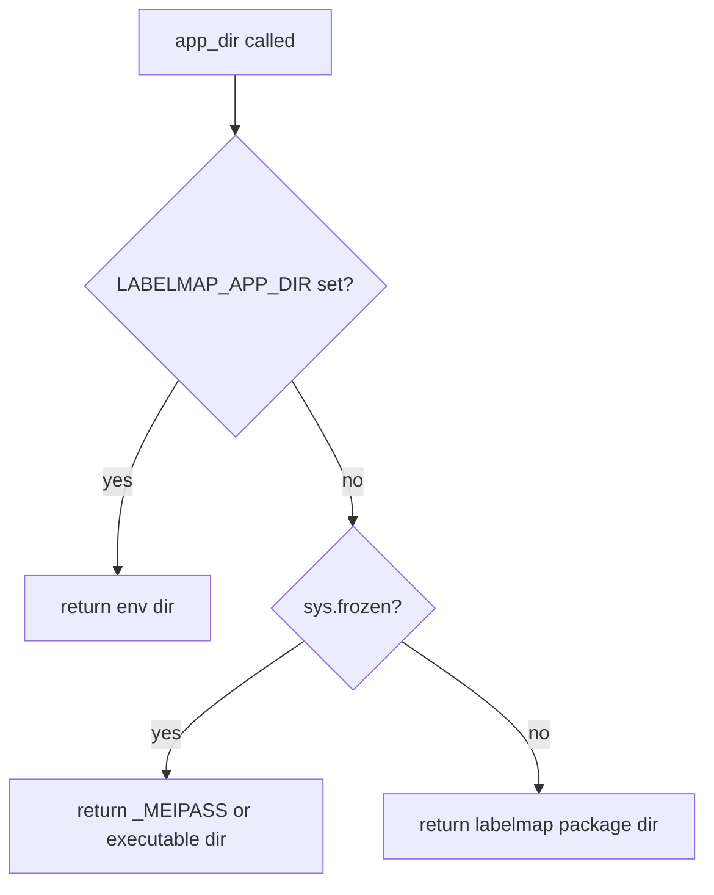

---

### 14.4 `labelmap/ui_copy.py`

**Purpose** — Holds all user-facing UI strings in one `UI` dataclass and provides display-name formatters so technical column names appear as friendly labels in pickers, legends, and the insight chat.

**Dependencies** — `labelmap.world_bank_baselines.WORLD_BANK_BASELINE_BY_LABEL`.

**Public API**

| Symbol | Type | Summary |
|--------|------|---------|
| `UI_COPY` | `UI` | Singleton of static panel strings |
| `display_dataset()` | function | Friendly dataset name for picker |
| `display_value_column()` | function | Friendly value-column label |
| `display_source_attribution()` | function | Rewrites `Source:` prefix for readers |
| `display_picker_source()` | function | Short source label (World Bank year or Yahoo) |

**Step-by-step flow**

1. `UI` dataclass defines defaults for data source, map controls, mapping errors, and insight chat copy.
2. `UI_COPY = UI()` instantiates the singleton at import time.
3. `display_dataset()` looks up `DATASET_DISPLAY` or falls back to underscore replacement.
4. `display_picker_source()` checks World Bank registry; returns `"World Bank · {year}"` or `"Yahoo Finance"`.

**UML**

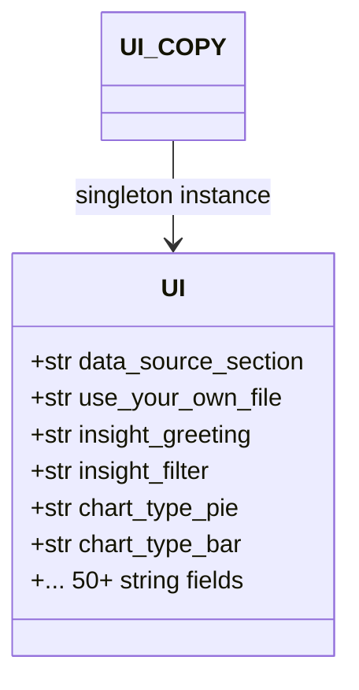

---

### 14.5 `labelmap/_debug_log.py`

**Purpose** — Temporary debug instrumentation that appends JSON lines to `.cursor/debug-07f454.log`. Used during map drag/view sync investigation. Does not affect application behavior on write failure.

**Dependencies** — `json`, `time` (stdlib).

**Public API**

| Symbol | Type | Summary |
|--------|------|---------|
| `debug_log()` | function | Append one JSON log line with location, message, data |

**Step-by-step flow**

1. Caller invokes `debug_log(location, message, data, hypothesis_id, run_id)`.
2. Build payload with session ID, timestamp, and caller metadata.
3. Append JSON line to log file.
4. On `OSError`, silently return (no exception propagated).

**UML**

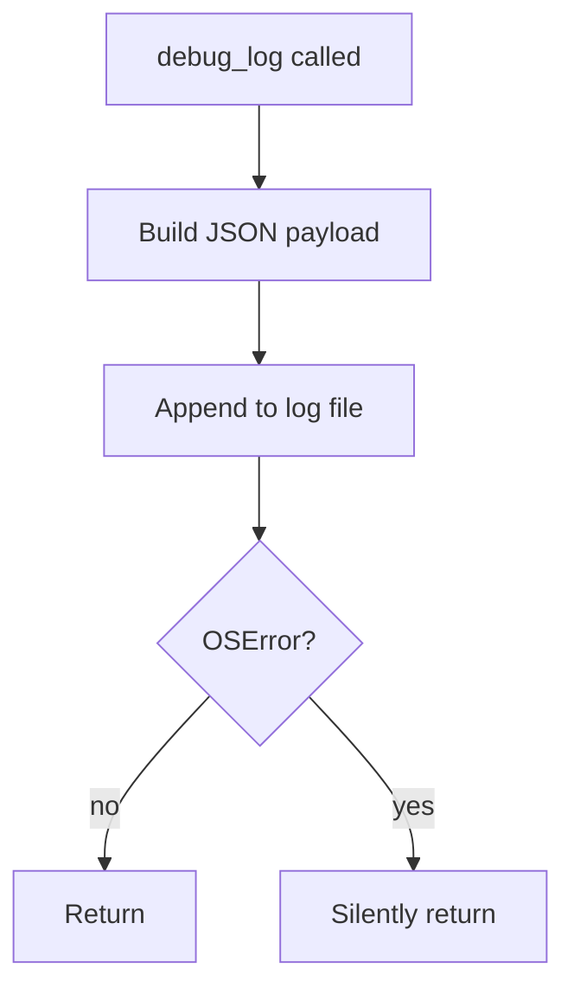

**Notes** — Hard-coded absolute log path; intended for local debugging only.

---

### 14.6 `labelmap/world_bank_baselines.py`

**Purpose** — Defines the `WorldBankBaseline` dataclass and registers 25 country-level indicators used by the KPI picker and `data_io.load_world_bank_baseline()`. Does not fetch data.

**Dependencies** — `dataclasses`, `typing` (stdlib).

**Public API**

| Symbol | Type | Summary |
|--------|------|---------|
| `WorldBankBaseline` | dataclass | One indicator definition (label, column, year, API code, CSV slug) |
| `WORLD_BANK_BASELINE_BY_LABEL` | dict | Label → baseline lookup |
| `WORLD_BANK_BASELINE_LABELS` | tuple | Ordered labels for picker dropdown |
| `world_bank_source_label()` | function | Legend attribution string |

**Step-by-step flow**

1. Module defines `_WORLD_BANK_BASELINES` tuple with 25 `WorldBankBaseline` instances.
2. `WORLD_BANK_BASELINE_BY_LABEL` maps `baseline.label` → baseline.
3. `WORLD_BANK_BASELINE_LABELS` preserves dropdown order (Population, GDP, …).
4. `world_bank_source_label()` formats `Source: World Bank ({code}, as of {year})`, using derived numerator/denominator for computed indicators.

**UML** — See [Section 5 class diagram](#class-diagram) for `WorldBankBaseline` fields.

---

### 14.7 `labelmap/data_io.py`

**Purpose** — Loads and normalizes all data sources: user uploads, World Bank baselines (API + CSV fallback), and World Index sample (bundled CSV + Yahoo Finance live merge). Provides column-mapping and coordinate-validation helpers.

**Dependencies** — `pandas`, `urllib`; `labelmap.paths`, `labelmap.world_bank_baselines`.

**Public API**

| Symbol | Type | Summary |
|--------|------|---------|
| `read_spreadsheet()` | function | Read CSV/XLSX into DataFrame |
| `load_world_bank_baseline()` | function | Load one World Bank indicator DataFrame |
| `build_world_bank_dataframe()` | function | API fetch with CSV fallback |
| `load_sample_dataframe()` | function | Load World Index sample |
| `get_nonzero_values()` | function | Extract non-zero value columns from a row |
| `coordinate_column_errors()` | function | Validate lat/lon column numeric range |
| `pick_default()` / `column_default()` | function | Auto-select column names |
| `spreadsheet_upload_key()` | function | Hash for upload session invalidation |
| `has_geographic_metadata()` | function | True when `Region` column present |

**Step-by-step flow — World Bank**

1. `load_world_bank_baseline(label)` looks up `WorldBankBaseline` by label.
2. `build_world_bank_dataframe()` fetches countries (paginated API) and indicator values.
3. For derived indicators, fetch numerator and denominator, then divide.
4. Merge coordinates; enrich with `Region` and `ISO3` via `_enrich_world_bank_metadata()`.
5. On API failure, `_load_world_bank_csv()` reads `data/world_bank/{csv_slug}.csv`.

**Step-by-step flow — World Index**

1. `_load_world_index_sample_dataframe()` reads bundled CSV/XLSX.
2. `_merge_live_market_values()` extracts market codes from `Loc` column.
3. Try Yahoo Spark API batch fetch; fall back to per-symbol chart API.
4. Compute 1d/7d/30d percentage columns; update location names with timestamps.

**UML — World Bank fallback** — See [Section 6.1](#61-data-loading).

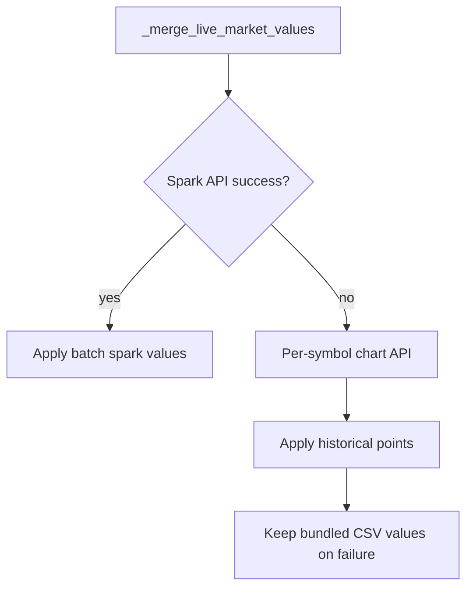

---

### 14.8 `labelmap/data_filter.py`

**Purpose** — Applies geographic and text filters to DataFrames with AND semantics. Shared by `label_map.py` (map markers) and `data_insight_chat.py` (insight panel). Manages filter-related session state keys.

**Dependencies** — `pandas`; `labelmap.data_io.has_geographic_metadata`.

**Public API**

| Symbol | Type | Summary |
|--------|------|---------|
| `parse_loc_country()` | function | Extract country from `"Country, CODE"` or timestamped name |
| `location_filter_key()` | function | Stable key ignoring live timestamps |
| `apply_data_filters()` | function | Filter by region, country, location, search |
| `available_regions()` | function | Sorted unique `Region` values |
| `available_locations()` | function | Sorted unique location names |
| `filter_is_active()` | function | True when any filter dimension is set |
| `filter_status_text()` | function | Human-readable filter summary |
| `clear_filter_state()` | function | Remove filter keys from session state |
| `get_filter_state()` | function | Read current filter dict from session |

**Step-by-step flow**

1. `apply_data_filters()` receives full DataFrame and filter parameters.
2. If `regions` set and `Region` column exists, mask by region membership.
3. If `countries` set, match parsed country names (case-insensitive).
4. If `locations` set, map names through `location_filter_key()` for stable matching.
5. If `search` set, case-insensitive substring match on name and parsed country.
6. Return filtered copy with reset index.

**UML**

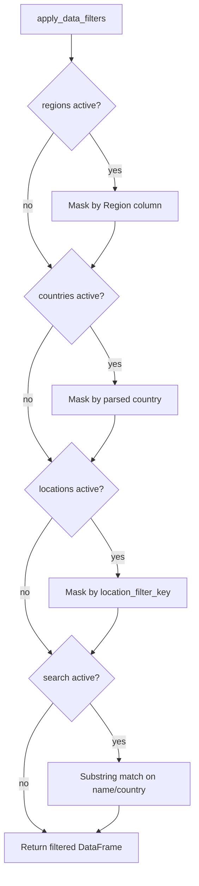

---

### 14.9 `labelmap/data_insights.py`

**Purpose** — Pure pandas/Altair analytics helpers for the insight chat. Builds summary tables, ranked top/bottom lists, bar/column/comparison charts, and narrative strings. Does not render Streamlit widgets.

**Dependencies** — `pandas`; optional `altair`; `labelmap.data_filter`, `labelmap.ui_copy`.

**Public API**

| Symbol | Type | Summary |
|--------|------|---------|
| `summary_table()` | function | Descriptive stats per value column |
| `ranked_table()` | function | Top or bottom N rows by metric |
| `chart_data()` | function | Long-format DataFrame for Altair bar chart |
| `column_chart_data()` | function | Data for single-metric column chart |
| `comparison_combo_chart()` | function | Dual-metric Altair combo chart spec |
| `build_greeting()` | function | Initial assistant greeting text |
| `action_intro_text()` | function | Intro line per insight action |
| `one_line_narrative()` | function | Dataset overview sentence |

**Step-by-step flow**

1. Chat action selected (e.g. `top10`) with active metric column.
2. `action_intro_text()` returns contextual intro string.
3. Action handler calls `ranked_table()` or `summary_table()` on filtered DataFrame.
4. For chart actions, `chart_data()` or `comparison_combo_chart()` builds Altair spec.
5. `data_insight_chat.py` renders table/chart via `st.dataframe` / `st.altair_chart`.

**UML**

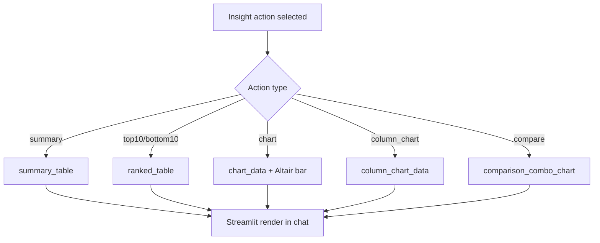

---

### 14.10 `labelmap/geo.py`

**Purpose** — Geospatial math for bounds fitting, zoom selection, Mercator projection, and connector endpoint calculation. Used by `map_session`, `export`, and `labels`.

**Dependencies** — `math` (stdlib).

**Public API**

| Symbol | Type | Summary |
|--------|------|---------|
| `latlon_distance()` | function | Euclidean distance in degree space |
| `fit_bounds_for_points()` | function | Padded `[[south,west],[north,east]]` from DataFrame |
| `best_zoom()` | function | Highest zoom fitting bounds in pixel viewport |
| `deg_lonlat_to_global_pixels()` | function | Web Mercator pixel coordinates at zoom |
| `normalize_lat_lon_for_projection()` | function | Wrap longitude, clamp latitude |
| `connector_points_px()` | function | Chart-to-label connector endpoints in pixels |

**Step-by-step flow**

1. `fit_bounds_for_points()` computes min/max lat/lon with padding; handles single-point degeneracy.
2. `best_zoom()` iterates zoom 10→1 until projected span fits width/height.
3. `deg_lonlat_to_global_pixels()` validates coords, applies Mercator formula.
4. `connector_points_px()` finds label box edge and chart circle edge along connecting line.

**UML**

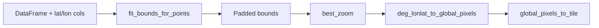

---

### 14.11 `labelmap/charts.py`

**Purpose** — Renders pie and column chart markers as inline SVG for Folium `DivIcon`, and as Pillow raster shapes for static export.

**Dependencies** — `math`; `labelmap.config` (radius limits, default colors).

**Public API**

| Symbol | Type | Summary |
|--------|------|---------|
| `marker_radius()` | function | Scale radius by total value |
| `make_chart_svg()` | function | SVG string for pie or column chart |
| `make_chart_icon_html()` | function | Wrapped SVG in sized div for Folium |
| `draw_chart_on_image()` | function | Pillow raster equivalent for export |
| `normalize_marker_type()` | function | Map `"bar"` → `"column"` |

**Step-by-step flow**

1. `marker_radius()` returns fixed mid-radius when scaling disabled or totals equal.
2. `make_chart_svg()` branches on `marker_type`:
   - **column** — stacked vertical bars scaled to max value.
   - **pie (single value)** — filled circle.
   - **pie (multi)** — SVG arc paths per segment.
3. `make_chart_icon_html()` centers SVG in `CHART_ICON_SIZE` container.
4. `draw_chart_on_image()` mirrors SVG logic on `ImageDraw`.

**UML**

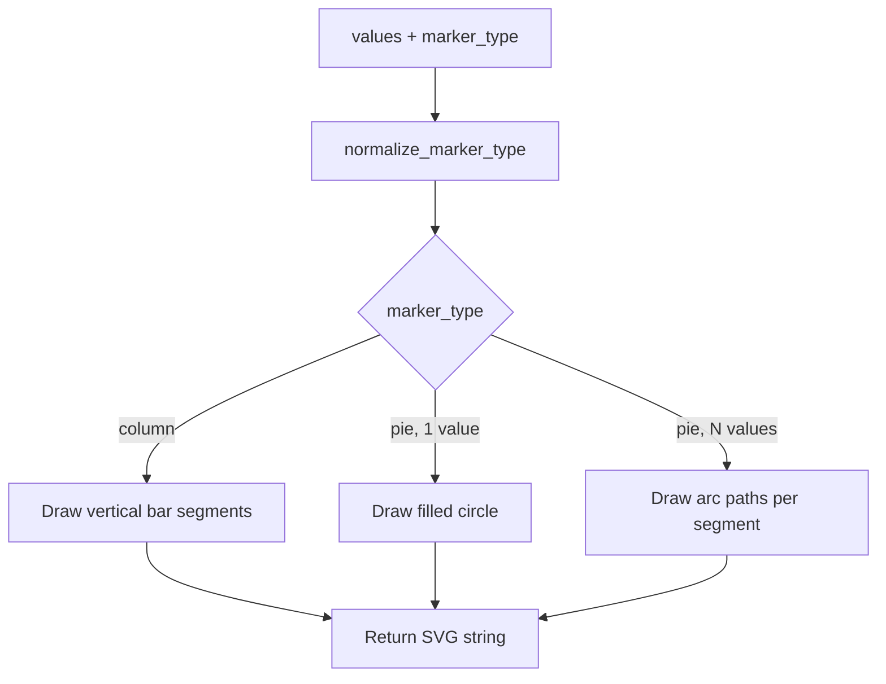

---

### 14.12 `labelmap/labels.py`

**Purpose** — Generates label HTML (name, values, percent change, total), estimates label dimensions, and places labels near markers without overlap. Applies market-index preset positions when available.

**Dependencies** — `labelmap.config`, `labelmap.geo`.

**Public API**

| Symbol | Type | Summary |
|--------|------|---------|
| `build_label_content()` | function | HTML fragments + icon width/height |
| `make_label_icon_html()` | function | Complete DivIcon HTML for Folium |
| `build_marker_tooltip_html()` | function | Hover tooltip for chart marker |
| `place_labels_near_markers()` | function | Overlap-free auto-placement |
| `format_compares()` | function | Percent-change coloring for World Index |

**Step-by-step flow**

1. `build_label_content()` assembles name, value rows, and optional total based on visibility flags.
2. `place_labels_near_markers()` sorts markers by neighbor density (clusters first).
3. For each marker, check `DEFAULT_MARKET_LABEL_POSITIONS` preset; if overlap-free, use it.
4. Otherwise `generate_label_placement_candidates()` tries 8 directions × 10 distance scales.
5. `label_boxes_overlap()` rejects candidates; first valid candidate wins.
6. Saved session drags override defaults in `map_session.label_positions_from_session()`.

**UML** — See [Section 6.3](#63-label-placement) for placement sequence diagram.

---

### 14.13 `labelmap/map_session.py`

**Purpose** — Manages Streamlit session state for map viewport, Folium widget keys, label drag persistence, and tooltip payload parsing. Bridges JavaScript drag events back to Python.

**Dependencies** — `streamlit`, `hashlib`; `labelmap.config`, `labelmap.geo`, `labelmap.labels`.

**Public API**

| Symbol | Type | Summary |
|--------|------|---------|
| `folium_widget_key()` | function | Per-upload-key `st_folium` widget key |
| `sync_dragged_labels()` | function | Parse tooltip; persist `label_lat_{idx}` |
| `sync_live_map_view()` | function | Merge bounds/zoom from `st_folium` return |
| `label_positions_from_session()` | function | Auto-place + merge saved drags |
| `get_map_view()` | function | Resolve center/zoom for map boot |
| `parse_label_drag_tooltip()` | function | Decode `label:{idx}:{lat}:{lon}|…` |
| `parse_map_sync_tooltip()` | function | Decode `view:fs:{0\|1}|…` |
| `clear_folium_widget_state()` | function | Drop stale folium keys on source switch |

**Step-by-step flow**

1. Before render, `sync_dragged_labels(prior_map_state)` parses prior tooltip if present.
2. `label_positions_from_session()` calls `place_labels_near_markers()`, then overlays `label_lat_{idx}` / `label_lon_{idx}`.
3. After `st_folium`, `sync_live_map_view()` updates `map_view` from returned bounds/zoom.
4. `sync_dragged_labels(map_state)` parses new drag tooltip; updates label coords and viewport.
5. If label moved, caller sets `map_label_updating` to enable drag guard on next fragment rerun.

**UML** — See [Section 6.2](#62-map-render-and-label-drag-sync) for drag round-trip sequence.

---

### 14.14 `labelmap/folium_elements.py`

**Purpose** — Injects custom Leaflet behavior via Folium `MacroElement` subclasses. Each class renders a Jinja2 template with embedded JavaScript (~1500 lines total). Does not contain Python business logic beyond template parameters.

**Dependencies** — `folium.elements.MacroElement`, `jinja2`; `labelmap.config`.

**Public API**

| Class | Summary |
|-------|---------|
| `DynamicConnectors` | Dashed polylines chart→label; updates on zoom/pan/drag |
| `LabelDragSync` | Encodes drag-end into marker tooltip |
| `MapDragGuard` | Blocks interaction while label saves |
| `MapSaveComplete` | Removes drag guard after save |
| `MapFrameFill` | Fills map container height |
| `SmoothZoomControl` | Hold-to-repeat custom zoom buttons |
| `SingleWorldMap` | No horizontal tile wrap; bounded panning |
| `MapViewRestore` | Restores center/zoom/fullscreen on load |
| `MapFullscreenControl` | Pseudo-fullscreen with zoom adjust |
| `FullscreenStateSync` | Syncs fullscreen flag via hidden marker tooltip |
| `MapLegend` | Value color swatches and attribution |
| `ExportMapStyles` | Screenshot-oriented CSS |
| `ExportReady` | Sets `data-map-export-ready` attribute |

**Step-by-step flow (per element)**

1. Python instantiates `MacroElement` subclass with map name and parameters.
2. `.add_to(m)` registers Jinja template on Folium map root.
3. On map `load`, JavaScript initializes Leaflet listeners.
4. Events (drag, zoom, pan) update DOM and/or marker tooltips.
5. `st_folium` returns updated tooltip to Python on next rerun.

**UML** — See [Section 7](#7-custom-folium-elements) table and [Section 5 class diagram](#class-diagram).

---

### 14.15 `labelmap/map_builder.py`

**Purpose** — Assembles the Folium map: base tile layer, control elements, chart markers, draggable label markers, connectors, and drag-sync JavaScript. Called exclusively from `ui.py` and `export.py`.

**Dependencies** — `folium`, `streamlit`; `charts`, `config`, `folium_elements`, `labels`, `map_session`.

**Public API**

| Symbol | Type | Summary |
|--------|------|---------|
| `build_base_map()` | function | Folium `Map` with single-world tiles |
| `build_interactive_map()` | function | Base map + controls + legend + view restore |
| `populate_map_layers()` | function | Chart markers, labels, connectors, drag sync |

**Step-by-step flow**

1. `build_interactive_map()` calls `get_map_view()` for center/zoom/fullscreen.
2. Create `build_base_map()` with selected tile style.
3. Attach `MapFullscreenControl`, `SmoothZoomControl`, `MapFrameFill`, `SingleWorldMap`, `MapViewRestore`, `FullscreenStateSync`, optional `MapLegend`.
4. `populate_map_layers()` iterates `marker_rows`:
   - Add chart `DivIcon` marker with tooltip.
   - Add label `DivIcon` marker at `label_positions[idx]` (draggable).
   - Collect connector and drag-sync metadata.
5. Attach `DynamicConnectors`, `MapDragGuard`, `LabelDragSync`, optional `MapSaveComplete`.

**UML**

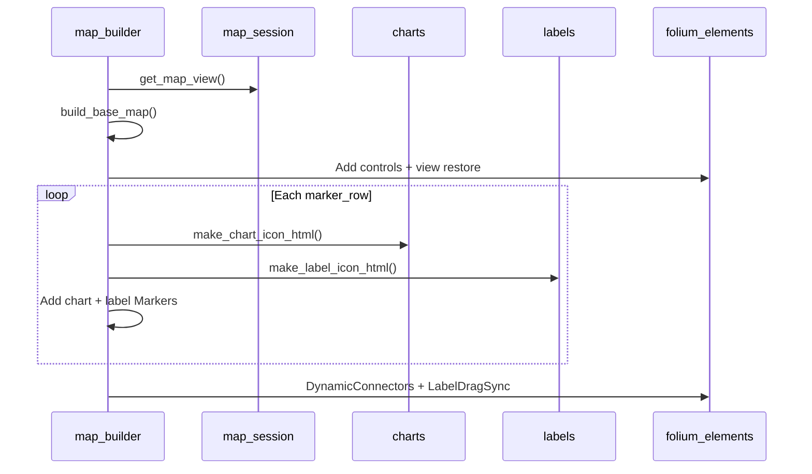

---

### 14.16 `labelmap/ui.py`

**Purpose** — Renders static page chrome (intro, footer, privacy, template link) and the interactive map via `@st.fragment`. Orchestrates label drag sync within the map column only.

**Dependencies** — `streamlit`, `streamlit_folium`; `config`, `export`, `map_builder`, `map_session`, `paths`.

**Public API**

| Symbol | Type | Summary |
|--------|------|---------|
| `render_app_intro()` | function | Hero tagline and how-it-works steps |
| `render_footer()` | function | About, privacy, contact, copyright |
| `render_template_link()` | function | Download link for sample CSV |
| `render_privacy_notice()` | function | Inline privacy text |
| `render_label_map_fragment()` | function | `@st.fragment` map render and drag sync |

**Step-by-step flow — map fragment**

1. Read `map_label_updating` and prior `st_folium` state from `folium_widget_key(upload_key)`.
2. `sync_dragged_labels(prior_state)` on entry.
3. `label_positions_from_session()` resolves label coordinates.
4. `build_interactive_map()` + `populate_map_layers()` construct Folium map.
5. `st_folium()` renders map; returns tooltip, bounds, zoom.
6. `sync_live_map_view()` and `sync_dragged_labels()` on exit.
7. Set `map_label_updating` if label moved; clear when save completes.

**UML**

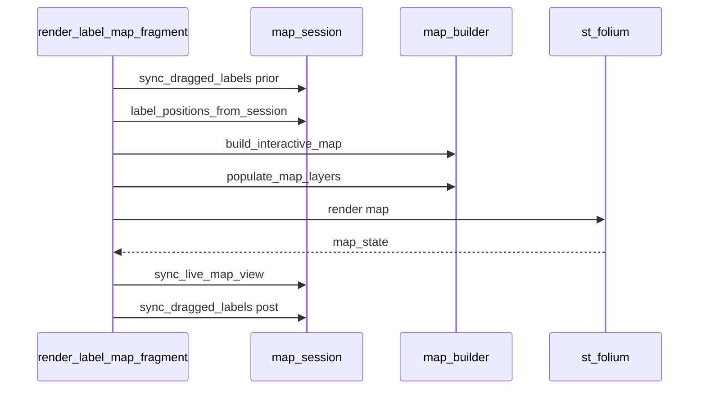

---

### 14.17 `labelmap/export.py`

**Purpose** — Produces JPEG map images via Playwright headless Chromium (preferred) or Pillow tile-stitching (fallback). Provides download href helpers for templates and filtered CSV. Powers insight chat map screenshots.

**Dependencies** — `folium`, `PIL`, optional `playwright`; `charts`, `config`, `folium_elements`, `geo`, `labels`, `map_builder`, `map_session`, `paths`.

**Public API**

| Symbol | Type | Summary |
|--------|------|---------|
| `export_map_image()` | function | Primary export entry (Playwright → Pillow) |
| `insight_map_screenshot()` | function | JPEG bytes from session map context |
| `capture_map_screenshot()` | function | Playwright-only screenshot |
| `generate_map_jpeg()` | function | Pillow tile-stitch export |
| `sample_template_download_href()` | function | Base64 data URL for sample CSV |
| `dataframe_csv_download_href()` | function | Base64 data URL for DataFrame CSV |

**Step-by-step flow — Playwright**

1. Rebuild map from `data_insight_map_context` or caller parameters.
2. Attach `ExportMapStyles` and `ExportReady` elements.
3. Save map to temporary HTML; launch Chromium at export viewport.
4. Wait for `[data-map-export-ready="true"]`; screenshot `.leaflet-container`.
5. Return JPEG bytes.

**Step-by-step flow — Pillow fallback**

1. Compute bounds and `best_zoom()` for export dimensions.
2. Fetch map tiles; stitch background canvas.
3. Project markers, labels, connectors onto raster.
4. `draw_chart_on_image()` renders chart icons; save JPEG.

**UML** — See [Section 10](#10-export-pipeline) flowchart.

---

### 14.18 `labelmap/kpi_picker.py`

**Purpose** — Centered Streamlit dialog for selecting built-in datasets (World Index metrics and World Bank indicators). Auto-opens on first visit; supports search filtering.

**Dependencies** — `streamlit`; `ui_copy`, `world_bank_baselines`.

**Public API**

| Symbol | Type | Summary |
|--------|------|---------|
| `kpi_picker_dialog()` | function | `@st.dialog` modal with searchable option rows |
| `render_kpi_picker_trigger()` | function | Button + auto-open logic |
| `filter_baseline_options()` | function | Search filter for dataset options |

**Step-by-step flow**

1. On first session visit, `_open_kpi_picker()` sets `_kpi_picker_open`.
2. `render_kpi_picker_trigger()` shows current dataset label; opens dialog if flagged.
3. User searches via `kpi_picker_search` session key; `filter_baseline_options()` narrows rows.
4. User clicks option row → `_finish_kpi_picker()` closes dialog, sets session key, `st.rerun(scope="app")`.
5. `label_map.py` reads updated dataset key and reloads data.

**UML**

```mermaid
sequenceDiagram
    participant User
    participant Trigger as render_kpi_picker_trigger
    participant Dialog as kpi_picker_dialog
    participant App as label_map.py

    Trigger->>Trigger: First visit? Open dialog
    User->>Dialog: Search + select option
    Dialog->>Dialog: _finish_kpi_picker
    Dialog->>App: st.rerun scope app
    App->>App: Reload DataFrame for new baseline
```

---

### 14.19 `labelmap/data_insight_ui.py`

**Purpose** — Thin adapter between `label_map.py` and `data_insight_chat.py`. Stores map render context for screenshot export and delegates panel rendering.

**Dependencies** — `streamlit`, `pandas`; `data_insight_chat`.

**Public API**

| Symbol | Type | Summary |
|--------|------|---------|
| `set_insight_map_context()` | function | Store map parameters in `data_insight_map_context` |
| `render_data_insight_panel()` | function | Call `render_data_insight_chat()` |

**Step-by-step flow**

1. After map render, `label_map.py` calls `set_insight_map_context()` with marker rows, label positions, style flags.
2. Context dict stored in `st.session_state["data_insight_map_context"]`.
3. `render_data_insight_panel()` passes filtered/full DataFrames and column names to chat renderer.

**UML**

```mermaid
sequenceDiagram
    participant Entry as label_map.py
    participant UI as data_insight_ui
    participant Chat as data_insight_chat

    Entry->>UI: set_insight_map_context
    UI->>UI: Store data_insight_map_context
    Entry->>UI: render_data_insight_panel
    UI->>Chat: render_data_insight_chat
```

---

### 14.20 `labelmap/data_insight_chat.py`

**Purpose** — Conversational insight panel below the map. Renders chat messages, action menus (summary, top/bottom 10, charts, filters, map image, CSV download), and chip-based filter UI. Persists chat per upload key.

**Dependencies** — `streamlit`, `pandas`; `data_filter`, `data_insights`, `export`, `ui_copy`.

**Public API**

| Symbol | Type | Summary |
|--------|------|---------|
| `render_data_insight_chat()` | function | Main panel entry point |
| `save_chat_session()` | function | Persist messages + filter state per upload key |
| `restore_chat_session()` | function | Restore messages when switching back to dataset |

**Step-by-step flow**

1. `render_data_insight_chat()` validates DataFrame and value columns.
2. `_ensure_initial_conversation()` seeds greeting via `build_greeting()`.
3. Render message history; latest message shows action button row.
4. User clicks menu action → `_handle_menu_click()` queues or executes action.
5. Filter flow: location chips → Apply → `apply_data_filters()` via session keys → map reruns filtered.
6. Map image action calls `insight_map_screenshot()`; CSV action builds download href.
7. On upload key change, `save_chat_session()` / `restore_chat_session()` swap chat buckets.

**UML**

```mermaid
sequenceDiagram
    participant User
    participant Chat as data_insight_chat
    participant Insights as data_insights
    participant Filter as data_filter
    participant Export as export

    User->>Chat: Click Top 10
    Chat->>Chat: _handle_action top10
    Chat->>Insights: ranked_table
    Insights-->>Chat: DataFrame
    Chat->>Chat: _append_message with table
    User->>Chat: Click Map image
    Chat->>Export: insight_map_screenshot
    Export-->>Chat: JPEG bytes
    User->>Chat: Apply location filter
    Chat->>Filter: sync session filter keys
    Note over Chat: label_map.py reruns with filtered df
```

---

### 14.21 `label_map.py`

**Purpose** — Streamlit application entry point. Configures page layout and global CSS, renders three-column UI (data source | map | controls), loads data, builds marker rows, applies filters, and wires map fragment plus insight panel. Must remain named `label_map.py` for Streamlit Cloud.

**Dependencies** — All major `labelmap` modules (see [Section 4](#4-module-reference)).

**Public API**

| Symbol | Type | Summary |
|--------|------|---------|
| Module body | script | Top-level Streamlit execution on each rerun |
| `_value_label_text()` | function | Truncate value column labels for UI |
| `_default_value_cols()` | function | Default selected columns per data source |
| `_world_index_legend_items()` | function | Legend swatches for market index |
| `_world_bank_legend_items()` | function | Legend + attribution for World Bank |

**Step-by-step flow**

1. `st.set_page_config()` — wide layout, collapsed sidebar.
2. Inject global CSS for LabelMap dark theme and control styling.
3. **Left column** — KPI picker trigger or upload toggle; load DataFrame (World Bank, World Index, or upload); column mapping selectboxes; validate coordinates.
4. Compute `upload_key`; on change, invalidate label positions, map view, chat state, folium widget keys.
5. `apply_data_filters()` using `get_filter_state()` from insight chat filters.
6. Build `marker_rows` list from filtered DataFrame via `get_nonzero_values()`.
7. **Center column** — `render_label_map_fragment()` with marker rows and display flags.
8. `set_insight_map_context()` then `render_data_insight_panel()` below map.
9. **Right column** — `st.tabs` (Map, Labels, Colors) for style, legend, label toggles, chart type, color pickers.
10. `save_chat_session()` / `restore_chat_session()` on upload key transitions.

**UML**

```mermaid
sequenceDiagram
    participant User
    participant App as label_map.py
    participant IO as data_io
    participant Filter as data_filter
    participant UI as ui.py
    participant Insight as data_insight_ui

    User->>App: Select data source / upload
    App->>IO: Load DataFrame
    App->>Filter: apply_data_filters
    App->>App: Build marker_rows
    App->>UI: render_label_map_fragment
    App->>Insight: set_insight_map_context
    App->>Insight: render_data_insight_panel
    User->>App: Adjust controls right column
    Note over App: Full page rerun
```

---

### 14.22 `scripts/refresh_world_bank_baselines.py`

**Purpose** — Maintainer CLI that fetches fresh World Bank data for all registered baselines and writes CSV fallbacks to `data/world_bank/`. Clears LRU caches between requests to avoid stale API reads.

**Dependencies** — `labelmap.data_io`, `labelmap.world_bank_baselines`.

**Public API**

| Symbol | Type | Summary |
|--------|------|---------|
| `main()` | function | Iterate baselines, write CSVs, report failures |
| `_clear_world_bank_caches()` | function | Clear `@lru_cache` on API fetch helpers |

**Step-by-step flow**

1. Resolve `ROOT` as parent of `scripts/`; insert into `sys.path`.
2. Ensure `data/world_bank/` exists.
3. For each baseline in `WORLD_BANK_BASELINE_BY_LABEL.values()`:
   - Clear World Bank LRU caches.
   - Call `build_world_bank_dataframe(baseline)`.
   - Write `{csv_slug}.csv` or record failure.
   - Sleep 2 seconds (rate limiting).
4. Print failures to stderr; exit code 1 if any failed, else 0.

**UML**

```mermaid
sequenceDiagram
    participant CLI as refresh script
    participant IO as data_io
    participant API as World Bank API
    participant Disk as data/world_bank

    loop Each baseline
        CLI->>IO: clear caches
        CLI->>IO: build_world_bank_dataframe
        IO->>API: Fetch countries + indicator
        API-->>IO: DataFrame
        IO-->>CLI: DataFrame
        CLI->>Disk: to_csv
        CLI->>CLI: sleep 2s
    end
```

---

### 14.23 `tests/test_data_filter.py`

**Purpose** — Unit tests for geographic/text filtering and World Bank metadata enrichment. Validates `data_filter` parsing, masking, and status text; mocks API metadata for `_enrich_world_bank_metadata()`.

**Dependencies** — `unittest`, `unittest.mock`, `pandas`; `labelmap.data_filter`, `labelmap.data_io`.

**Public API**

| Symbol | Type | Summary |
|--------|------|---------|
| `DataFilterTests` | class | `unittest.TestCase` with 15 test methods |
| `_sample_df()` | function | World Index-style test DataFrame |
| `_world_bank_df()` | function | World Bank-style test DataFrame with Region |

**Step-by-step flow (test execution)**

1. `python -m unittest tests/test_data_filter.py` discovers `DataFilterTests`.
2. Each test builds a fixture DataFrame and calls filter/metadata functions.
3. Assertions verify row counts, location sets, status text content, and enriched columns.

**UML — coverage map**

```mermaid
flowchart LR
    tests[test_data_filter.py]
    tests --> parse[parse_loc_country]
    tests --> key[location_filter_key]
    tests --> apply[apply_data_filters]
    tests --> regions[available_regions]
    tests --> locs[available_locations]
    tests --> status[filter_status_text]
    tests --> active[filter_is_active]
    tests --> meta[has_geographic_metadata]
    tests --> enrich[_enrich_world_bank_metadata]
```

**Test cases covered**

| Test | Function under test |
|------|---------------------|
| `test_parse_loc_country_splits_market_suffix` | `parse_loc_country` |
| `test_location_filter_key_strips_live_timestamp` | `location_filter_key` |
| `test_apply_data_filters_locations_match_stable_keys` | `apply_data_filters` (timestamp keys) |
| `test_apply_data_filters_search_matches_country_name` | `apply_data_filters` (search) |
| `test_apply_data_filters_region_for_world_bank_data` | `apply_data_filters` (region) |
| `test_apply_data_filters_country_list_matches_parsed_names` | `apply_data_filters` (country) |
| `test_available_regions_sorted_unique` | `available_regions` |
| `test_filter_status_text_when_active` | `filter_status_text` |
| `test_apply_data_filters_locations_multi_select` | `apply_data_filters` (locations) |
| `test_apply_data_filters_empty_locations_does_not_filter` | `apply_data_filters` (empty guard) |
| `test_available_locations_sorted_unique` | `available_locations` |
| `test_filter_status_text_includes_locations` | `filter_status_text` |
| `test_filter_is_active_true_when_locations_set` | `filter_is_active` |
| `test_filter_is_active_false_when_empty` | `filter_is_active` |
| `test_has_geographic_metadata_requires_region_column` | `has_geographic_metadata` |
| `test_enrich_world_bank_metadata_adds_columns` | `_enrich_world_bank_metadata` |

---

## Related documents

- [README.md](../README.md) — User-facing quick start and features
- [CONTRIBUTING.md](../CONTRIBUTING.md) — Development setup and pull request guidelines
- [CHANGELOG.md](../CHANGELOG.md) — Version history
