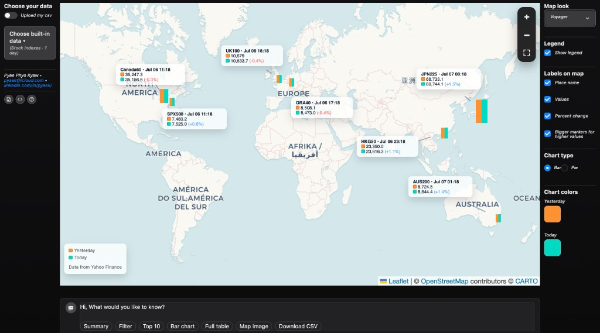
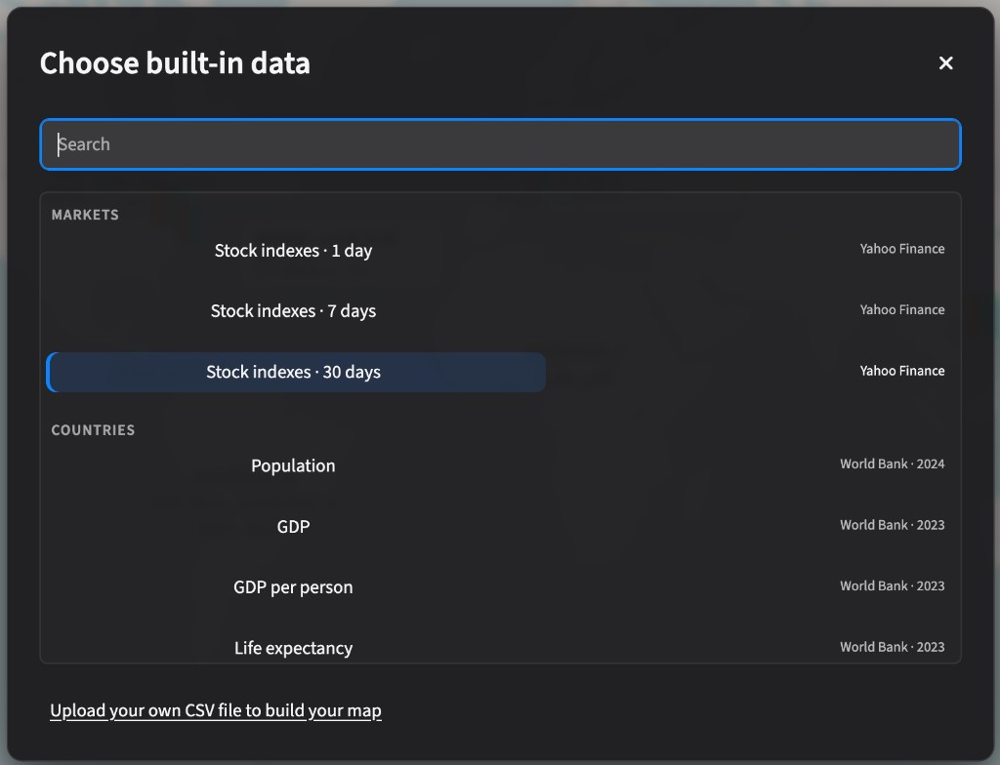
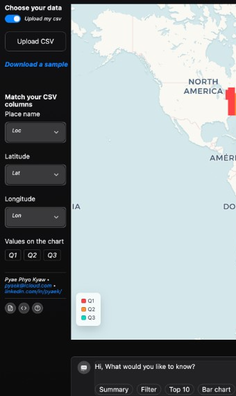
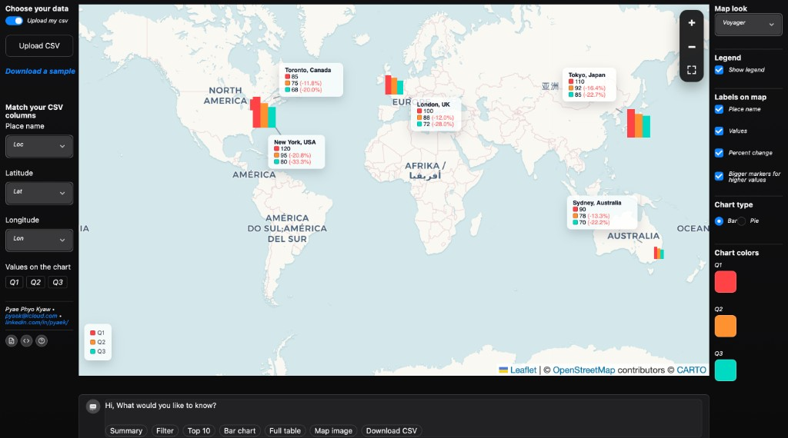

# LabelMap User Guide

LabelMap turns places and numbers into an interactive world map — no coding or special software needed.

**Open the app:** https://label-map.streamlit.app

**You need:** a web browser and either the built-in sample data or your own CSV file.

---

## Quick start

1. **Pick your data** — choose built-in data or upload your own CSV.
2. **Explore the map** — pan, zoom, and read the chart markers and labels.
3. **Customize and download** — change colors and chart style, then save a table or map image.

---

## Know your screen



The app has four main areas:

- **Left** — Choose your data (built-in picker or CSV upload).
- **Center** — The interactive world map with chart markers.
- **Right** — Map look, legend, labels, chart type, and colors.
- **Bottom** — Data insights buttons (Summary, Filter, Top 10, and more).

---

## Path A — Use built-in data (no file needed)



1. On your first visit, the **Choose built-in data** window opens automatically.
2. Use **Search** or browse two categories:
   - **Markets** — stock index performance (1 day, 7 days, or 30 days).
   - **Countries** — world statistics like population, GDP, and life expectancy.
3. Click a dataset — for example, **Stock indexes · 1 day**.
4. The map loads with chart markers at each location.

**What you see on the map:**

- Each marker is a small bar chart comparing two time periods.
- **Orange** = Yesterday · **Teal** = Today (see the legend in the bottom-left corner).
- Hover over a marker to see exact values and percent change.
- Use **+** and **−** in the top-right corner of the map to zoom in and out.

**Tip:** To switch datasets later, click the built-in data dropdown on the left under **Choose your data**.

Want to use your own file instead? Click **Upload your own CSV file to build your map** at the bottom of the picker window.

---

## Path B — Upload your own CSV

### Step 1 — Turn on upload



1. On the left, turn on **Upload my csv** (the toggle turns blue).
2. Click **Upload CSV** and pick your file from your computer.
3. Don't have a file ready? Click **Download a sample** to get an example you can open in Excel or Google Sheets.

### Step 2 — Match your columns



After uploading, tell LabelMap which columns to use:

| Control | What it means |
|---------|---------------|
| **Place name** | The column with city or country names |
| **Latitude** | The north/south number (between −90 and 90) |
| **Longitude** | The east/west number (between −180 and 180) |
| **Values on the chart** | Which number columns to show (tap Q1, Q2, Q3 to turn them on or off) |

**Your CSV file should have:**

- One row per place.
- Latitude and longitude as numbers (not text).
- At least one column of numbers for the chart.

Example format (column names can be anything — you match them in the app):

```csv
Loc,Lat,Lon,Q1,Q2,Q3
"New York, USA",40.7128,-74.0060,120,95,80
"London, UK",51.5072,-0.1276,100,88,72
```

---

## Read the map

- Each location has a small **bar** or **pie** chart sitting on the map.
- A **dashed line** connects the chart to its **label** showing the place name, values, and optional percent change.
- **Drag a label** if it sits in the wrong spot — click and move it. It stays in place when you zoom or pan.
- **Bigger markers** mean higher values when **Bigger markers for higher values** is turned on in the right panel.

---

## Change how it looks

Use the right panel to customize the map:

- **Map look** — try Voyager, Dark, Light, Street, Terrain, or Topo.
- **Show legend** — turn the color key on or off on the map.
- **Labels on map** — show or hide place name, values, percent change, and marker sizing.
- **Chart type** — switch between **Bar chart** and **Pie chart** (bar works best when you have several values to compare).
- **Chart colors** — click the color squares to pick your own colors.

---

## Explore data with the bottom panel

Below the map, use the buttons to dig into your data:

| Button | What it does |
|--------|--------------|
| **Summary** | Quick overview table with key statistics |
| **Filter** | Pick specific places — the map updates to show only those |
| **Top 10** | Ranked list of the highest values |
| **Bar chart** | Visual comparison of your numbers |
| **Full table** | Every row in a spreadsheet view |
| **Map image** | Save a picture of the map as you see it |
| **Download CSV** | Export your data as a CSV file |

Filters affect both the table and the map. When you switch to a different dataset, filters are cleared automatically. Use **Reset chat** to start fresh.

---

## Common problems

| Problem | What to try |
|---------|-------------|
| Map is empty after filtering | Click **Reset chat**, or open **Filter** and clear your selection |
| Upload error | Make sure latitude and longitude are numbers, and at least one value column is selected |
| Built-in data won't load | The app loads a saved backup copy automatically — or upload your own CSV |
| Labels overlap | Drag labels to a clearer spot, or turn off some options under **Labels on map** |

---

## FAQ

**Do I need an account?**  
No. Just open the link in your browser.

**What file type can I upload?**  
CSV only. If your data is in Excel, use *Save As → CSV* first.

**Do I need to install anything?**  
No. LabelMap runs in your web browser.

**Can I use it offline?**  
The map background needs an internet connection. Your uploaded file stays in your browser session only.

**Who made LabelMap?**  
Pyae Phyo Kyaw — see [Get help](#get-help) below.

---

## Get help

**Pyae Phyo Kyaw**  
Email: [pyaek@icloud.com](mailto:pyaek@icloud.com)  
LinkedIn: [linkedin.com/in/pyaek](https://www.linkedin.com/in/pyaek/)
